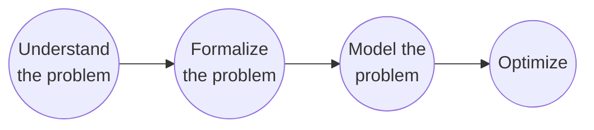

# Combinatorial Optimization Problems (COP)

A combinatorial optimization problem can be defined in 3 terms:

$P = (\mathcal{N}, \mathcal{F}, c)$

- finite universe $\mathcal{N}$
- Set of feasible solutions $\mathcal{F}$. The set of feasible solutions
  must be a subset of power set of the universe $\mathcal{N}$.

$$
\mathcal{F} \subseteq 2^{\mathcal{N}}
$$

- cost (weight) function

$$
    c : \mathcal{N} \mapsto \mathbb{R}
$$

Cost of feasible solution:

$$c(S) := \underset{e \in S}{\sum} c(e)$$

Optimal solution:

$$S^* = \underset{S \in \mathcal{F}} {argmax} \quad c(S)$$


Basically, $\mathcal{N}$, i.e. the Universe consists of the **most
atomic selectable objects in a solution.**

The set of feasible solution are:

Find all possible subsets you can make from $\mathcal{N}$. A solution is
one of the possibilities. 

Now, the feasible solutions are **all the subsets in $2^\mathcal{N}$ which
really solve the problem**

Cost function is nothing, but a function that **maps each elementary
selectable object to a real number**

## Shortest path problem as Combinatorial Optimization Problem

Given a graph $G = (V, E)$ . Find the shortest path from vertex `s` to `t`

Defining it in terms of Combinatorial Optimization Problem:

1. Universe: $\mathcal{N}$ = $E$

The most atomic selectable object in this problem would be an edge. And
a collection of edges will then form a path. Hence, we select the set of
edges as the universe.

2. Set of feasable solutions 

$$\mathcal{F} = \{ P \subseteq E \mid
   \text{P is an s-t path} \mid
   P \subseteq 2^\mathcal{N} \mid
   \text{P is a collection of set of edges}\}$$

If we have $|E|$ edges then the total number of distinct collections we
can make is the power set of $E$ because you can either select or
reject each edge. 

Now, from these power set, only the collection of edges which form a
path between s and t are our feasible solutions.

3. Cost function: $c: \mathcal{N} \mapsto \mathbb{R}$

And the cost function here is given by:

$$
c(e) = -1
$$

Usually, we want to maximize the cost. But since, here we want to
minimize the number of edges we want to select. We are assigning each
edge a cost of -1.


## Max Clique problem as Combinatorial Optimization Problem

A Clique in a subgraph (a subset of vertices), such that **any two
vertices in the subgraph are connected by exactly one edge.**

Max Clique problem asks you to **find a clique with maximum number of
vertices**. Less vertices cliques are easy to find but cliques with more
vertices are difficult to find.

The COP formulation is as follows:

Input: $G=(V, E)$
Output: clique with max number of vertices

You can define your output, and your formulation in terms of vertices or
edges.

COP of a Max Clique problem using vertices:

1. The universe $\mathcal{N}=V$

The most atomic selectable object we consider here is a vertex then.

2. The set of feasible solutions: 

$$
\mathcal{F} =
S \subseteq \mathcal{N} \mid \text{S is a clique}
$$

All possible subset of vertices are given by $2^\mathcal{N}$. Out of
these, only some of them would be cliques.

3. The cost function is given by:

$$
c(v) = 1
$$

Since we want to maximize the number of vertices selected, we assign
each vertex a cost of 1.


## Other problems

### Traveling salesman problem (TSP)

Given n cities and the pairwise distance between them
Find **shortest possible tour that visits each city exactly once**
and returns to the starting city.


### Satisfiability

Given a boolean formula $\phi$, is there an assignment to the given
variables such that the formula evaluates to True.

Examples:

$$
\overline{x_1} \wedge (x_1 \vee x_2) \wedge (x_1 \vee x_3)   
$$

### Graph coloring problem

Given a graph, color its nodes with the minium number of colors such
that no two adjacent nodes share the same color

### Knapsack problem

Given n objects with values $v_i$ and weights $w_i$, and a knapsack of
capacity $W$. Find a subset of objects whose total weight does not
exceed the size of the knapsack, while maximizing the total value.


### Binpacking

Given n objects with sizes $c_i$, pack them into the fewest number of
identical bins of capacity $C$.


## General decision making process:




If you come up with a simple model then you can usually achieve exact
solution. But the simple modle itself does not completely represent
the problem then.

Or if u come up with a complex model, then you can only get an
**approximate solution**. But, the model itself is fairly accurate in
representing the problem

## Solution methods to NP hard problems

The NP hard problems can be solved by using either:

1. Exact methods:

    1. $A^*$ algorithm
    2. Simplex method (LP)
    3. Branch and Bound
    4. Dynamic programming
    5. Constraint programming

2. Approximate methods

    1. Heuristic Algorithms:
        1. Constructive Heuristics (e.g. Greedy algorithms)
        2. Improvement Heuristics (Local search)
        3. Hybrid Methods
        4. Approximate Algorithms


# The change problem

Supposse we have N denominations. For each demoninations you have
unlimited number of coins. What is the minimum number of coins to make
an amount M;

How to solve the coin change problem;

## Idea 1: Choose the largest possible denomination at each step


Given denominations: $c_1, c_2, \ldots, c_n$

Suppose, you need to make the amount M, and the largest possible
denominaiton is available is $c_k$. Then you can take at most x coins such
that:

$$
c_k \times x <= M
$$

$$
x <= \frac{M}{c_k} \\
$$

$$
x = \lfloor \frac{M}{c_k}  \rfloor \quad \text{Since x is an integer}
$$


Hence, just sort the denominations in decreasing order. Iterate through
the denominations and take $\lfloor M / c_i\rfloor$. The remaining
amount required is $M-\lfloor M / c_i \rfloor$. Repeat until remaining
amount is 0;

Also, note that we need to have a coin of denomination 1. Just in case,
lets say remaining amount = 3 but we only have coins of denomination 5
and 7. Then we will be in a deadlock.


A simple python implementation look like the following:

```python
def coinChangeGreedy(denominations, M):
    req = 0
    denominations.sort(reverse=True)
    for ck in denominations:
        req += M // ck
        M -= M // ck
    return req
```

The big question: **is this algorithm correct?**

To proove incorrectness of an algorithm, we can simply come up with a
counter example.

```
For example, the algorithm works for the instance:

    ( 8, (5,3,1) )

But not for:

    ( 8, (5,4,1) )
```

Because, in the second case, the optimal solution is taking 2 coins of
denomination  4 to make up amount 8 rather than 

**And is this algorithm efficient?**

Yes, fairly efficient because it sees each denomination exactly once,
which is I believe the minimum required, if we want to construct the
solution.

## Brute force algorithm

Suppose we have k denominations: $c_1, c_2, \ldots, c_k$

Each $i^{th}$ denomination is picked by $x_i$ number of times. Then,

Then:

$$
Amount = x_1 \times c_1 + x_2 \times c_2 \ldots x_k \times c_k
$$

Subject to:  $x_i <= \lfloor M / c_i \rfloor$

And $x_1, x_2, \ldots$ are integers.

Now we can just basically try all possible values for all $x_i$.

Wooh, this is basically the general version of an integer linear
program.

A simple program that does this job using recursion is as follows:

```python
def coinChange(i, denominations, amount):
    if amount < 0 or i >= len(denominations):
        return math.inf

    if amount == 0:
        return 0

    # take the current coin
    take = 1 + coinChange(i, denominations, 
                            amount-denominations[i])

    reject = coinChange(i+1, denominations, amount)

    return min(take, reject)
```

**Is this solution correct?**
Yes

**Is this solution optimal?**
No

Because, for each denomination, we are taking 2 choices. Hence, the
running time of this algorithm is exponential: $O(2^n)$.

## Recursion

We can model this problem in a recurrence relation. 

$$
coinChange(M) = \min
\begin{cases}
    \text{coinChange}(M-1) + 1, \\
    \text{coinChange}(M-3) + 1, \\
    \text{coinChange}(M-5) + 1
\end{cases}
$$

Here's a basic implementation of the barebones recursion:

```python
def coinChange(denominations, amount):
    if (amount < 0): 
        return math.inf 
    if (amount == 0): 
        return 0

    required = math.inf

    for ck in denominations:
        # select the coin@i. Then we have 1 coin used
        required = min(
                required, 
                1 + coinChange(denominations, 
                                amount-ck)
        ) 

    return required
```

**is this solution correct: yes**

**is this solution optimal: no**

This solution is not efficient because if we look at the recursion tree
the same problems are being solved again and again.

We can improve upon this version such that we can use previously
computed results. In that case, this solution will be optimal.

We need the tabulation version of this algorithm.  For the tabulation,
we first fill all the dp table with infinity:

> dp[i] = k means that to make up the amount i, we need atleast k coins.

```text
dp[0 - n] = infinity
dp[0] = 0 // base case for making amount of 0

from i -> 1 - amount

    for each denom of denomination:
        z = 1 (current coin of denom) + 
        (minimum number of coins required to
        for amount i - denom)

        update dp[i] with min(dp[i], z)
```

In simple python implementation, it looks something like:

```python
def coinChange(coins, amount):
    dp = [ math.inf for _ in range(amount+1) ]
    dp[0] = 0

    for i in range(1, amount+1):
        for denom in coins:
            dp[i] = min(dp[i], 1 + dp[i-denom]) 
                if i-denom >= 0 else dp[i]
    
    return dp[amount]
```

# Running time analysis:

The function $f(n)$ is $O( g(n) )$, if 

there exists a $c > 0$ and $n_0 \ge 0$ such that:

$f(n) \le c \cdot g(n)$ 

for all $n \ge n_0$

Which means that at some point before infinity, $g(n)$ will exceed $f(n)$


Some common run times and their comparison:

$$
O(1) \le O(log\ n) \le O(n) \le O(n\ log\ n) \le O(n^2) \le O(2^n) \le O(n!)
$$

Also, **note that:**

O( ${}^nC_r$ ) = $O(n^r)$


O( $log(n!)$ ) = O($n\ log n$)

# NP and computational hardness

How can we define computational hardness.

For some problems we can define a lower bound.

1. Comparison based sorting takes atleast $O(n\ log\ n)$

For some problems, we can find a brute force solution

2. Finding power set shall take atleast O($2^n$)

But for most hard problems, we can neither find a polynomial time
algorithm nor prove that it takes atleast exponential time

So we try to classify them into clusters by showing that they are all
equvalent to each other, i.e. they are reducable

To proove a problem is hard, you **reduce it into another problem that
has shown to be hard**. Then you can argue, that if there was a
polynomial time algorithm for this problem, then there should have been
a polynomial time algorithm for the other existing hard problem as well.

## Polynomial time reducability

Suppose Y is polynomial time reducable to X, then  generally:

Y can be divided into k instances of X in polynomial time. That is we
   divide Y into subproblem such that each subproblem is a type of
   problem X. Then we solve each of these subproblem, using some
   arbitrary method. And then, we can combine all of the solutions to
   these k subproblems into a single solution of problem Y in polynomial
   time. 

This defination is not completely correct. Here's the more accurate
official defination:

A problem Y is polynomial time reducable to problem X ( $Y \leq_p X$ ),
if there exists an algorithm that solves any instance of Y by making
polynomially many elementary operations and polynomially many calls to a
black box solver for problem X.

Again:

A problem Y is polynomial-time reducable to a problem X.
$$Y \leq_p X$$, 

if there exists an algorithm that solves any instance of Y making
polynomially many elementary operations. And making polynomially many
calls to a black-box solver for X.

Here the method of solving X is not in our concern. We just want to show
equvalence between the two.

The main idea is that if we could have a black-box solver for X that
solves it in polynomial time. It would automatically imply thta Y can be
solved in polynomial time. 

Lemma 1:

Suppose, $Y \leq_p X$. If X can be solved in polynomial time, then Y can
be solved in polynomial time. 

Lemma 2:

Suppose, $Y \leq_p X$. If Y cannot be solved in polynomial time, then X
cannot be solved in polynomial time either.

Implied from Lemma 1;

# Independent set problem

A **set of vertices** are **independent if no 2 of them are connected by
a direct edge**.

$G=(V, E)$

An independent set: 

$$I \subseteq V$$ 

such that,

$${i, j \in I \mid \text{i and j are not connected by a direct edge}}$$

In an independent set of vertices, you can pick any 2 of them, and there
should be no edge between the 2.

## Maximum independent set problem

When you model it as decision problem:

For input graph $G$, and a number $k$ decide if $G$ contains an
independent set of size **atleast** $k$

> [!IMPORTANT]
> In the slides, they have **independent set of size exactly k**

You can also model it as optimization problem:

For input graph $G$, find the independent set of maximum possible size.

**The decision version and optimization version are reducable to each
other. Why?**


The maximum number of vertices that can be part of an independent set
are $|V|$ that is all nodes are in the independent set.  While the
minimum number of nodes that can be in an independent set is $0$ i.e. no
nodes taken. In fact an empty graph is always independent. With these 2
things in mind.  We can easily reduce the decision version and
optimization version to each other.

1. Decision version $\leq_p$ Optimization version
    suppose we are trying to solve `decision_independent_set(G, k)`
    then we have an optimization solver `optimization_independent_set(G)`
    Simple: if `optimization_independent_set(G) >= k` 
    return true else false
    
2. Optimization version $\leq_p$ Decision version
    Linear or Binary search on the range (0, |V|)
    to find the highest possible k for which decision
    version returns true


Going back the the defination of a Clique. A clique is a subgraph of a
graph such that every 2 vertices of it are connected by exactly one
edge. Finding a maxclique and an independent set of maximimum size are
equvalent problems. The proof is not discussed here.

# Vertex cover problem

A **set of vertices is said to be a vertex cover** if **every edge in
the graph has atleast one end connected to one of the vertice in
this set.**

A graph $G=(V, E)$. The vertex cover is given by: $C \subseteq V$, i.e.
$C$ contains some vertices of $V$ such that all edges $e \in E$ touches
atleast one vertex in $C$.

## Minimum vertex cover problem

A vertex cover containing all the vertices of the graph is naturally a
vertex cover because it obviously touches all the edges. The problem is
always about finding the vertex cover containing the minimum number of
vertices.

The decision version of the problem can be stated as follows:

Instance: a graph $G$, and a number $k$
Objective: Decide if $G$ contains a vertex cover of size $k$?

> [!IMPORTANT]
> can also be formulated as: "... if $G$ contains a vertex cover of size $\leq k$"


# Vertex cover and Independent set relationship

In a graph $G=(V, E)$. $S \subseteq V$ is an independent set if and only
if $G - S$ is a vertex cover.

How can you proove it?

By definition, a vertex cover is a set of vertices such that they touch
all edges in the graph. If $G-S$ is a vertex cover, then there shall be
no edge which lies completely in $S$, since those are the only edges
which are completely untouched by $G-S$.

Suppose you have an edge $e$, such that one of its end is in $S$. Naturally,
the other end of $e$ cannot be in $S$, since S is independent.

Therefore, the other end of $e$ is in $G-S$. The same argument can be
made for every edge in $S$. Hence, there is no edge which lies
completely in $S$, which  implies $G-S$ touches all the vertices
in the graph (provided it is connected).

Therefore, $G - S$ is a vertex cover (a set of vertices that touch every
edge).


## 2 way proof

1. Proof that in a graph $G$, if $S$ is an independent set, then $G-S$ is a vertex cover;

    Consider an edge $e=(u,v)$ in $S$. Since, $S$ is an independent set,
    both $(u, v)$ cannot lie in $S$. Therefore, one of them must lie in
    $G-S$. The same argument can be made for every vertex in $S$. This
    means, that $G-S$ touches every edge in the graph and hence is a
    vertex cover.

2. Proof that in a graph $G$, if $G-S$ is a vertex cover, then $S$ is an
   independent set;

    Consider 2 vertices $(u, v)$ in $S$. If $(u, v)$ can be joined by an
    edge, it would mean that $G-S$ is not a vertex cover, since there is
    an edge that lies completely outside of it. This implies, that no 2
    vertices in $S$ are connected by a direct edge. Therefore $S$ is an
    independent set.

## Reducability of vertex cover problem  and independent set problem

Independent set problem and vertex cover problem are reducable to each
other. Why? 

Definitions:

Independent set problem (decision version): Is there an independent set
of size $\geq k$

Vertex cover problem (decision version): Is there a vertex cover of size
$\leq k$

Reducability:

1. $\text{Independent set problem} \leq_p \text{Vertex cover problem}$

    If we are able to find an independent set of size $\geq k$ lets say
    $S$. Then there is a corresponding vertex cover of size $\leq
    |V|-k$.

2. $\text{Vertex cover problem} \leq_p \text{Independent set problem}$

    If we are able to find a vertex cover of size $\leq k$, then there
    is a corersponding independent set of size $\geq |V|-k$    

# Satisfiability problem

## Intro

A **boolean formula** in **conjunctive normal form (CNF)** is a
conjunction of clauses where each clause is a disjunction of literals;

Example,

$$
(x_1 \vee x_2 \vee x_3) \wedge (\overline{x_1} \vee x_5)
$$

Please note that in boolean satisfiability problem, the formula inside
the brackets `()`, is called a clause. And inside of the clause, **you
can only have OR operator**. And the **clauses are always AND
together**. This is called **conjuctive normal form (CNF)**.

In general:

$(OR)\wedge(OR)\wedge(OR)$

Therefore, the following is not a valid **CNF**:

$$
( x_1 \wedge x_2 \wedge x_3 \wedge x_4 ) \vee ( x_2 \wedge x_5 )
$$

A **k-CNF** is a CNF where each clause contains exactly k literals. 

Eaxmple (k=3):

$$
(x_1 \vee x_2 \vee \overline{x_3}) \wedge
(x_3 \vee  \overline{x_5} \vee x_6) \wedge
(x_1 \vee  \overline{x_4} \vee x_7)
$$

## Satisfiability Problem

Satisfiability problem (SAT):

Input: A CNF $\phi$ <br>
Objective: Decide if $\phi$ is satisfiable. i.e. is there an assignment
so that $\phi$ is **true**

k-Satisfiability problem (k-SAT):

Input: A k-CNF $\phi$ <br>
Objective: Decide if $\phi$ is satisfiable

# 3-SAT is polynomially reducable to Independent set problem

Theorm:

$$
\text{3-SAT} \leq_p \text{Independent set problem}
$$

To solve the 3-SAT problem:

1. Choose one literal from each clause
2. You cannot choose same variable across different clauses. For example
   you cannot have $x$ in one clause and $\overline{x}$ in another
   clause
3. Then assign truth values to the variables so that the formula
   evaluates to true

We can encode this idea using a graph:

- choose **one literal per clause is like selecting one vertex per
  triangle**
- avoiding conflicts so that all chosen literals are true

## Formulation

Suppose we have variables: $x_1, x_2, \ldots, x_n$
And clauses: $C_1, C_2, \ldots, C_k$

#### Vertices:

For each clause $C_i = (l_{i1}, l_{i2}, l_{i3})$

- create 3 vertices for this clause
- each vertex corresponds to one literal in the clause

Total vertices = 3k = n

#### Edges:

1. Clause edges (triangles)

For each clause $C_i$, connect all three vertices:

$v_{i1}, v_{i2}, v_{i3}$

This forms a triangle, ensuring at most one literal per clause can be
chosen.

#### Conlfict edges:

For any 2 vertices corresponding to complementary literals (e.g. $x_j$
and \overline{x_j}), add an edge between them.

## Target independent set size

The target size:


$$
k = \text{number of clauses}
$$

Because every triangle allows at most one vertex, an independent set
cannot exceed size $k$.

## Decision

If we are able to find an **independent set of size $k$**, then the
3-SAT problem is solvable. Otherwise not.

## Correctness proof

1. If the formula is satisfiable

    - each clause has at least one true literal
    - choose one true literal per clause
    - add the corresponding vertices to the set $S$

2. Why $S$ is an independent set of size $k$

    - no two vertices come from the same triangle
    - no conflicts occur because a valid assignment never sets both $x$
      and $\overline{x}$

## Example

Consider the following 3-SAT problem:

$$
(x_1 \vee \overline{x_2} \vee x_3 ) \wedge (\overline{x_1} \vee x_2 \vee x_4 )
$$

First we draw the graph for the first clause:

```
        x1
       /  \
   ¬x2 ---- x3
```

Then for the second clause:

```
        ¬x1
       /   \
     x2 ---- x4
```

Now we draw the edges between conflicts (i.e. $x_i --- \overline{x_i}$
):

```
        x1 ---------------- ¬x1
       /  \                /   \
   ¬x2 ---- x3          x2 ---- x4
       \                /
        ----------------
```

In this graph, we have number of clauses = 2 = $k$.

Hence, we **need to find an independent set** of size $k=2$

The independent set of size 2: $(x_1, x_4)$ or $(x_3, x_4)$.

Since, we are able to find an independent set of size 2. It **means that
the 3-SAT problem has a solution**.


### Check

We replace $(x_1=1, x_4=1)$, and all other variables to 0 in the
original equation.

$$
(1 \vee \overline{0} \vee 0) \wedge (\overline{0} \vee 0 \vee 0) =
1
$$

Hence, confirmed that there is a solution for this 3-SAT problem. You
can also use the other independent set i.e. $(x_3, x_4)$ to obtain
another possible solution for this problem.

# P, NP and NP-complete

For any computational problem, we can represent its inputs as binary
strings (in fact, this is what computers do internally, because inputs
are represented in memory as binary numbers).

Decision problems are problems that return a binary output. 

**Polynomial running time**

An algorithm $(A)$ runs in **polynomial time** if there exists some
**polynomial function** $p$ such that: **On any binary input string $s$
of length $|s|$, $A$ is guaranteed to finish within $O(p(|s|))$ steps**

## P computational class definition

**P: all problems for which there exists a polynomial time algorithm**

To learn about NP, we shall know about a checker for a problem.

**An efficient checker $B$ is a polynomial-time algorithm that verifies
whether a proposed solution (certificate) is correct for a given problem
instance.**

Note that the checker does not need to find the solution, it only needs
to verify it.

An algorithm $B$ is an efficient certifier for problem $X$ if:

1. $B$ **is a polynomial time algorithm**
2. It has 2 inputs:
    - $s$: The actual problem instance (i.e. the question). $s \in X$
    - $t$: A proposed solution ("certificate")
3. There exists a polynomial function $p$ such that $t \leq p(|s|)$
4. For all valid certificates $t$, $B(s,t) = \text{yes}$

> [!IMPORTANT]
> This definition is too complex. For the exam, just put it in simple
> words

Basically, if $s$ is solvable, then there exists a solution $t$ such
that $B(s,t) = \text{yes}$. Note that, $X$ itself is a decision problem. 
And $s$ in an instance of problem $X$ so $s$ is a decision problem. What
we are interested here is that if we have a candidate solution $t$ then
$B(s,t)$ can reliably tell us, weather the solution is valid.

Computational assymetry: finding $t$ migth be hard (exponential search
space). But checking $t$ might work in polynomial time. 

## NP computational class

**NP: The class of all problems for which there exists an efficient
certifier**

$$
\text{Lemma: } \text{P} \subseteq \text{NP}
$$

It states that **for every problem that can be solved in polynomial
time, it can also be verified in polynomial time.**

Proof: We **claim that a polynomial time solver $(A)$** is itself a
**polynomial itme certifier $(B)$**.

Here's why:

$$
\begin{align*}
   \text{if there is an input that outputs true for problem s} & \\
   a(s) = \text{true} \implies \exists t: b(s,t) = \text{true} & \\ \\
    \text{if there is no input that outputs true for problem s} & \\
    a(s) = \text{false} \implies b(s,t) = \text{false} \forall t & \\
\end{align*}
$$

Independent set problem and 3-SAT problem are $NP$, however it is not
trivial to proove that they require more than polynomial time to solve.


## The million dollar question

$$
\text{is P = NP?}
$$

If that is true, then **every problem that can be checked in polynomial
time can also be solved in polynomial time.**

Another way you can ask this question is, **is there a problem that can
be checked in polynomial time but cannot be solved in polynomial time?**

$$
\text{Is there a problem:} X \in \text{NP} \text{ but } X \notin P
$$

If such a problem exists, it would imply $\text{P} \neq \text{NP}$.
If no such problem exists, it would imply $\text{P} = \text{NP}$

## NP-complete

An NP-complete problem $(X)$ is a **problem for which there is a
polynomial time certifier, and all other problems which have a
polynomial time certifier can be reduced to problem $X$**.

**NP-complete: A problem $(X)$ is NP complete if:**

- $X \in \text{NP}$
- $\forall Y \in \text{NP}, Y \leq_p X $


This has one interesting implication:

$$
\text{Lemma: if any NP-complete problem can be solved in polynomial
time} \implies \text{P = NP}
$$

### Circuit satisfiability problem

Circuit satisfiability problem is an **NP-complete problem;**

It models a circuit as a DAG consisting of:

- inputs
- logic gates
- wires
- single output

The objective is to decide weather a circuit is satisfiable (returns
true) for any set of inputs;


One main observation we can make about NP-completeness is:

$$
\text{If X is NP-complete}, Y \in \text{NP and} \\
X \leq_p Y, \text{then Y is NP-complete as well}
$$

Independet set problem and Vertex cover problem are NP-complete
problems;

# Greedy algorithms

The greedy approach:

1. greedy approach works by choosing locally optimal solution at each
   iteration step; hoping that it will lead to a globally optimal
   solution
2. Decisions are never reversed

## Required conditions for greedy to work

The following 2 conditions are necessary for greedy appraoch to work:

1. Optimal substructure property: The problem can be divided into
   subproblems such that the **optimal solution to the problem can be
   obtained using optimal solution to its subproblems.**

   more formal: A problem has optimal substructure property if the
   **optimal solution to a problem can be obtained using optimal solution
   to its subproblems**

2. Greedy choice property: A problem depicts greedy choice property if
   the **globally optimal solution can be arrived at by making locally
   optimal choices at each iteration step without reconsidering previous
   choices**


## Case knap-sack problem

You have a knapsack of capacity $W$, $n$ number of items each carrying a
weight $w_i$ and value $v_i$. The goal is to fill the knapsack
maximizing the total value, while also ensuring that the total weight
does not exceed $W$.

The problem has 2 versions:

1. partially selectable items: In this version, each item can be divided
   into parts, and you can take a fraction of the item in the knapsack

    This varient has both **optimal substructure property and greedy
    choice property. Therefore, a greedy approach works**

2. 0-1 knapsack version: In this version, each item is either selected
   or not. You cannot divide an item and take a fraction of it

    This varient **does have  optimal substructure property, however it
    does not have greedy choice property. Hence a greedy approach does
    not work.** This problem actually requires dynamic programming.

## Minimum spanning tree (MST)

Given an undirected graph $G=(V,E)$ with edge weights $w_e \in
\mathbb{R}$, $\forall e \in E$.

Find a tree (undirected, asyclic graph, graph) $T=(V, E^{\prime})$ such
that:

1. $E^{\prime} \subseteq E$ 
2. $E^{\prime}$ minimizes:

$$
\underset{e \in E^{\prime}} {\sum} w_e
$$ 

Greedy intuition: at each iteration step, add the minimum weight edge
that does not create a cycle with previously included graph;

This is the basic idea behind kruskals algorithm, however WHY DOES IT
WORK?

### Prims algorithm

1. select a random vertex
2. maintain a seen list (for vertices) and min-heap (for edges)
3. Add edges connected to starting vertex in min heap
4. ```while no edges in min heap:
    select min weight edge in min heap
    if this edge connects to an unseen vertex (say V'):
        continue
    else:
        add V' to seen list
        add all the edges connected to V' in min heap
        save this edge```

5. return saved edges

### Kruskals algorithm

1. sort the edges in increasing order of weight
2. iterate through edges: <br>
    save the edge if it does not form a cycle
3. return saved edges

How to track if an edge forms a cycle or not. 

> [!NOTE]
> Idea: use union and find to track connected components


### MST and greedy?

The big question: prove that greedy approach can find an MST


Definition partition: A partition of a set $X$ consists of 2 subsets
$(A,B)$ such that $A \cup B = X$, and $A \cap B = \emptyset$.

Definition cut: For a graph $G=(V,E)$, **a cut is a partition of $V$.**

Definition respect: Given graph $G=(V,E)$. Suppose we have a collection
of edges $E^{\prime} \subseteq E$. Then, a **cut $(S,V-S)$ of graph
$G=(V,E)$ respects $E^{\prime}$ iff, $\forall \text{ edges } (u,v) \in
E^{\prime}$, either $(u, v) \in S$ or $(u, v) \in (V-S)$**. Simply speaking
there shall not be an edge which connects the subsets $S$ and $V-S$.

#### The cut property

Let **$A$ be a subset of edges of some MST** of $G=(V,E)$. Let $(S,
V-S)$ be **a cut that respects $A$**. Let **$e$ be the lightest edge
across this cut** (i.e. an edge connecting $S$ and $V-S$).  Then, $A
\cup \[e\]$ us part of some MST.


Proof:

Here we try to prove by contradiction that $e$ is part of some MST in
the graph.

1. By assumption, $A$ is a subset of edges of some MST (say $T$)
2. $e=(u,v) \text{ such that } u \in S \text{ and } v \in (V-S)$ is the
   lightest edge connecting $S$ and $(V-S)$
3. Suppose, $e$ is not part of $T$. Then,

    - $T$ is still the MST but does not use $e$
    - Since, $T$ cannot be disconnected, lets assume that there is
      another edge $e^{\prime}$ which connects $S \text{ and } (V-S)$.
      This edge $e^{\prime}$ is part of MST $T$ instead of $e$.
    - Since, we assume that $e$ is the lightest edge across the cut.
      $w_e \lt w_{e^{\prime}}$
    - Now, we construct another spanning tree $T^{\prime}$, such that $T^{\prime}
      = T \setminus \[e^{\prime}\] \cup e$.
    - Accordingly:

$$
\begin{align*}
w(T^{\prime}) = w(T) - w(e^{\prime}) + w(e) &\\
\implies w(T) - w(T^{\prime}) = w(e^{\prime}) - w(e) &\\
\implies w(T) - w(T^{\prime}) \gt 0  
                                \quad \text{since } w_e \lt w_{e^{\prime}}  &\\
\implies w(T) > w(T^{\prime}) &
\end{align*}
$$

Which means that $T$ is not a minimum spanning tree, because we found
another spanning tree $T^{\prime}$ with smaller total weight.  **This is
a contradiction of our initial assumption**. Hence, $e$ must be part of
some MST.


We can also prove that this problem has optimal substructure property
and greedy choice property:

1. Optimal substructure: For a graph, $G=(V,E)$, we can divide it into
   an arbitrary cut $(S, V-S)$. The minimum spanning tree of the graph
   $G$ can then be obtained by combining the minimum spanning trees of
   subgraphs $(S, V-S)$ and choosing the smallest edge that connects $S
   \text{ and } (V-S)$.

$$
MST(G) = MST(S) + \underset{u \in S, v \in (V-S)}{ \min } e_{u,v} +
MST(V-S)
$$


Hence, solution to the problem can be obtained using solution to its
subproblems. Therefore, the problem of finding a Minimum Spanning Tree
in a graph has optimal substructure.

2. Greedy choice property: Noting the above equation, we also note that
   at each iteration step, we select the lowest weight edge across the
   cut. Hence, the greedy choice property also holds for this problem;


# Solving NP hard problems on trees

## Independent set problem on trees

**Given a tree, find maximuim cardinality subset of nodes such that no 2
share an edge**


The key observation here is:

**If $v$ is a leaf node, then there exists an independent set of maximum
cardinality that contains $v$**.

Proof:

Let $v$ be a leaf node in the tree, with parent node $u$. And
$\mathcal{S}$ be the independent set of maximum cardinality on this
tree. 

We start by assuming that $v \notin \mathcal{S}$

There are 2 cases:

Case 1: $u \notin \mathcal{S}$ and $v \notin \mathcal{S}$

In this case we can construct a new independent set $\mathcal{S}^{\prime} = 
\mathcal{S} \cup v$ 

This implies:

$$
|\mathcal{S}^{\prime}| = |\mathcal{S}| + 1
$$

Hence, we found another independent set larger than $\mathcal{S}$ which
implies that our $\mathcal{S}$ is not the maximum independent set, which
is a contradiction to our initial assumption.


Case 2: $u \in \mathcal{S}$ but $v \notin \mathcal{S}$

In this case, we can build another independent set which does not
include node $u$ but includes node $v$.

$$
\mathcal{S}^{\prime} = \mathcal{S} \setminus u \cup v
$$

In this case, the cardinality of $\mathcal{S}$ is same as
$\mathcal{S}^{\prime}$.

$$
|\mathcal{S}^{\prime}| = |\mathcal{S}| + 1
$$

Hence, we obtained another maximum independent set which includes $v$.

Therefore, any maximum independet set of a tree must contain its leaf
nodes.


A simple algorithm to solve maximum independet set problem on
trees:

1. While graph is not empty<br>
    for each leaf node (v) of the graph<br>
        add v to maximum independet set<br>
        <br>
        remove v and all the nodes which are <br>
        connected to v by an edge<br>

2. return maximum independet set


## Maximum-weight independent set on trees

In this problem, we are again trying to find the maximum independent
set, however each node in the graph is associated with a weight. We need
to find an independent set that maximizes the total weight of selected
nodes. 

This problem cannot be solved using greedy approach, since it does not
have greedy choice property. We cannot make choices in isolation in this
case.

## Set cover problem

**Given:**

* A **universe** $(U)$ of elements. For example: $U$ = {1, 2, 3, 4, 5}
* A **collection of sets** $S_1, S_2, ..., S_m$ where each  $S_i
  \subseteq U$. 

  For example: $S_1$ = {1, 2}, $S_2$ = {2, 3, 4}, $S_3$ = {4, 5}

**Goal:**

* Find the **smallest subcollection** of sets from subsets $S_1, S_2,
  \ldots S_m$ whose **union covers the entire universe $U$**.
* In other words, pick as few sets as possible so that every element of
  $U$ appears in at least one chosen set.

Formally:

Input: 

- A universe set $U$
- subsets $S_1, S_2, \ldots, S_n \subseteq U$

Output:

- A collection of subsets $T$ such that every subset $x \in T$ is also
  in $U$, $x \in U$. And $\sum x = U$
- minimize $|T|$, i.e. the number of selected subsets 

Note: 

* The Set Cover Problem is **NP-hard**.
* This means that **no polynomial-time algorithm is known** to always
  find the minimum set cover.

### Greedy approach for set cover problem


A basic greedy heuristic: at each iteration step, select the subset of
maximum cardinality. The idea is to cover as many elements as possible
in each selection.

**Is this algorithm correct?**

No. It is not guaranteed that the greedy appraoch will return minimum
number of subsets

But how bad is this algorithm. Can we quantify it?

**Theorm: Let n be the number of subsets. If the optimal solution
uses k subsets, then a greedy algorith will use at most k log(n)
subsets**


# Linear programming 

The general form of a linear program can be written as follows:

$$
\begin{align*}
    \max \quad c^T x \\
    \text{s.t.} \quad Ax &\geq a \\
                Bx &\leq b \\
                Dx &= d \\
                x^{\prime} &\geq 0 \\
                x^{\prime\prime} &\leq 0
\end{align*}
$$

Where:

$$
c = \begin{pmatrix}
    c_1 \\
    c_2 \\
    \ldots \\
    c_n
\end{pmatrix}
\in \mathbb{R}^n
\quad \quad
x = \begin{pmatrix}
    x^{\prime} \\
    x^{\prime\prime} \\
    x^{\prime\prime\prime}
\end{pmatrix}
\in \mathbb{R}^n
$$

1. $c$ is the column vector of cofficients
2. $c^T \cdot x$ is a single scalar obtained by dot product:
   $\sum_{j=1}^{n} c_j \cdot x_j$
3. $x^{\prime}$ are non-negative constraints
4. $x^{\prime\prime}$ are non-positive constraints
5. $x^{\prime\prime\prime}$ are free variables
6. $A \in \mathbb{R}^{m_1 \times n}$ and $a \in \mathbb{R}^{m_1 \times 1}$
7. $B \in \mathbb{R}^{m_2 \times n}$ and $b \in \mathbb{R}^{m_2 \times 1}$
8. $D \in \mathbb{R}^{m_3 \times n}$ and $b \in \mathbb{R}^{m_3 \times 1}$ 

Any linear program can be written in one of the 2 standard forms:

1. $\max$ { $c^T x \mid Ax \leq b$ }
2. $\max$ { $c^T x \mid Ax = b, x \geq 0$ }

Generally, we use the first form. 

## How to solve Linear programs

### Simplex method

Simplex algorithm works by finding a solution, and iteratively improving
it until it cannot be improved any further. The last solution obtained
is optimal.

#### Motivating example

We understand simplex method by using a simple example:

$$
\begin{align*}
    \text{max} \quad  5x_1 + 4x_2 + 3x_3 \\
    \text{s.t.} \quad 2x_1 + 3x_2 + x_3 &\le 5 \\
    4x_1 + x_2 + 2x_3 &\le 11 \\
    3x_1 + 4x_2 + 2x_3 &\le 8 \\
    x_1, x_2, x_3 &\ge 0
\end{align*}
$$

To solve this problem we first introduce slack variables, such that each
slack variable is non-negative. We can obtain the slack variables by
rearranging the equations in the form $\geq 0$. The objective function
is denoted by $z$ as per convention.

$$
\begin{align*}
    x_4 &= 5 - 2x_1 - 3x_2 - x_3 \\
    x_5  &= 11 - 4x_1 - x_2 - 2x_3 \\
    x_6  &= 8 - 3x_1 - 4x_2 - 2x_3 \\
    \hline
    z    &= 5x_1 + 4x_2 + 3x_3 \\
    \text{maximize} z \quad & 
    \text{s.t.} x_1, x_2, x_3, x_4, x_5, x_6 \ge 0 
\end{align*}
$$

This **formulation is known as a dictionary**.  The new variables we
created i.e. $x_4, x_5, x_6$ are called slack variables while the
original variables $x_1, x_2, x_3$ are called decision variables.

It is important to believe that **these 2 equations are essentially
equvalent.  If you find the answer to one, you can apply the solution to
the other.**

With simplex method we **start with a feasible solution, and in each
iteration come up with another better feasible solution.** Repeating
this process infinite number of times, we are guaranteed to lead to
optimal solution.

For the equation above, the simplest solution we can think of is: $x_1 =
x_2 = x_3 = 0$. This might not be optimal solution, but it is a feasible
solution to get us started. Since, **no constraints are violated when we
make all decision variables 0 in this dictionary. It is called a
feasible dictionary.** The ***first dictionary obtained from the
original LP needs to be feasible, for simplex to work***. Otherwise, we
need to do some preprocessing.

If we substitute $x_1 = x_2 = x_3 = 0$, then we obtain $x_4=5, x_5=11,
x_6=8 \text{ and } z=0$

Now we must find a better solution. And if we look at the optimization
function $z$, we observe that we can increase the value of $x_1$ while
keeping the value of  $x_2 = x_3 = 0$. But, if we choose $x_1=2$ then we
obtain, $z=10$ and $x_4=1, x_5=2, x_6=2$. That even better, lets try
$x_1=3$. Then we obtain $z=15$, $x_4=-1, x_5=-1, x_6=-1$ which  is a
problem! because we need all the variables to be positive.

So the bottom line is that we do want to increase $x_1$ as much as we
can, but we cannot increase it too much. If you look at the equations
for $x_4, x_5, x_6$ carefully, you observe that for $x_4, x_5, x_6 \ge
0$ we need $x_1$ to be greater than $5/2=2.5, 11/4=2.75, 8/3=2.6$
respectively. But then the question is, which constraint takes
precedence?


Out of these, $5/2=2.5$ is the lowest possible. Which means, as soon as
$x_1$ crosses 2.5, the condition for $x_4$ is violated, as it goes below
$0$.  While we are trying to increase $x_1$, that first variable that is
violated is $x_4$ because it has the lowest bar of violation. Therefore,
our choice of increasing $x_1$ is dictated by the first violating
variable.

If we substitute $x_1=5/2$ in this system of equations, we obtain the
following solution:

$$
\begin{align*}
    x_1 = 5/2 \quad x_2 = x_3 = x_4 = 0 \quad x_5=1 \quad x_6=1/2 \quad z=25/2
\end{align*}
$$

This is indeed an improvement over our previous solution (z=0). But now
as we have a better solution, what do we do with it. Have we solved the
problem? No because we still do not know weather our solution is
optimal.

Can we construct another problem using this solution, such that we make
some progress on the original problem.

We notice that variables that assume positive values are on left hand
side, while variables that are 0 are on right hand side of the equation.

We observe that when we increase the value of $x_1=5/2$ (i.e. make it
positive) then we can obtain a better solution. But then $x_4=0$ (i.e.
make it zero).

In general the variables that assume positive value, should be on the
left while variables that assume negative values shall be on the right.

The **variables on the left hand side are called basic variables $\geq
0$, while the variables on the right hand side are called non-basic
variables $=0$**.

Since, we now made $x_1$ positive and $x_4=0$. These variables shall
exchange positions. This is trivial by rearranging equation:

$$
x_1 = \frac{5}{2} - \frac{x_4}{2} - \frac{3x_2}{2} - \frac{x_3}{2}
$$

Here, $x_1$ is said to have entered basis while $x_4$ is said to have
left basis.

We can then substitute this value of $x_1$ in equations for $x_5, x_6$
as well.

This allows us to obtain a new dictionary. We can repeat this process
indefinately, until we can no longer improve the objective.  This
happens **when all cofficients of $x_i$** in objective function $z$ are
negative. We can obtain the optimal value by setting $\forall x_i=0$.

Continue solving the orignal problem, we obtain the following new
dictionary after substituting the value of $x_1$.

$$
\begin{align*}
   x_1 &= \frac{5}{2} - \frac{3x_2}{2} - \frac{x_3}{2} - \frac{x_4}{2} \\
   x_5 &= 1 + 5x_2 + 2x_4 \\
   x_6 &= \frac{1}{2} + \frac{x_2}{2} - \frac{x_3}{2} + \frac{3x_4}{2} \\
   \hline
   z &= \frac{25}{2} - \frac{7x_2}{2} + \frac{x_3}{2} - \frac{5x_4}{2}
\end{align*}
$$

Here, we can observe that only the cofficient of $x_3$ is positive.
Therefore, we can increase $x_3$ while keeping other variables 0.

Now, we need to ensure that $x_1, x_5, x_6 \geq 0$.

$$
\begin{align*}
    x_3 \leq 5 &\rightarrow x_1 \geq 0 \\
    x_3 \leq 1 &\rightarrow x_6 \geq 0
\end{align*}
$$

The variable with lowest bar of violation is $x_6$ therefore, $x_3$
enters basis, while $x_6$ leaves basis. Also, $x_3 = 1$ yields, $z=13$
which is improvement over previous iteration. 

$$
    x_3 = 1 + x_2 + 3x_4 - 2x_6
$$

Substituting in $x_1, x_5, z$, the new dictionary obtained is:

$$
\begin{align*}
    x_1 &= 2 - 2x_2 - 2x_4 + x_6 \\
    x_3 &= 1 + x_2 + 3x_4 - 2x_6 \\
    x_5 &= 1 + 5x_2 + 2x_4 \\
    \hline
    z &= 13 - 3x_2 - x_4 - x_6 
\end{align*}
$$

Finally, we observe that objective $z$ can no longer be improved by
increasing any $x_i$, since the co-efficients of all $x_i$ are positive.
Hence, the obtimal value is $z=13$ with the original decision variables:
$(x_1, x_2, x_3) = (2, 0, 3)$, obtained by substituting $x_2, x_3,
x_4=0$ in the above equations.

**But what happens if we do not obtain a feasible dictionary in the first step?**

#### When first feasible dictionary is not available

In this case, we need to build something called an auxilary dictionary.
Let's understand with the help of an example:

$$
\begin{align*}
    \text{max} \quad &  x_1 + 2x_2 \\
    \text{s.t.} \quad x_1 + x_2 &\leq  6 \\
    -2x_1 - x_2 &\leq -2 \\
    x_1, x_2 &\geq  0 \\
\end{align*}
$$

To find the first basic solution, we first introduce slack variables
and define $z$ for objective function as per convention:

$$
\begin{align*}
    x_3 &= 6 - x_1 - x_2 \\
    x_4 &= -2 + 2x_1 + x_2 \\
    \hline
    z &= x_1 + 2x_2 \\
    \text{s.t.} \quad \max{z} & \quad x_1, x_2, x_3, x_4 \ge 0
\end{align*}
$$

Now if we substitute, $x_1 = x_2 = 0$, then we obtain $x_3=6, x_4 = -2$.
Which is **invalid**. Because, $x_4$ is suppose to be positive.
Therefore, we cannot find a initial basic solution.  We can solve this
problem by building an auxilary problem.

We build an autilary problem by introducting $x_0$ variable **which is
substracted from every constraint on left hand side**. The objetive
function is to maximize $-x_0$ or simply minimize $x_0$.

$$
\begin{align*}
    \text{max}  \quad   -x_0 \\
    \text{s.t.} \quad   x_1 + x_2 - x_0 &\leq 6 \\
                        -2x_1 - x_2 - x_0 &\leq -2 \\
                        x_0, x_1, x_2 &\geq 0 \\
\end{align*}
$$

Now, lets try to again define slack variables for our auxilary problem:

$$
\begin{align*}
    x_3 &= 6 + x_0 - x_1 - x_2 \\
    x_4 &= -2 + x_0 + 2x_1 + x_2 \\
    \text{s.t.} & \quad x_0, x_1, x_2, x_3, x_4 \ge 0 \\
    \hline
    w &= -x_0
\end{align*}
$$

Now lets try to find a basic solution to this auxilary problem.  If we
substitute $x_1 = x_2 = 0$ then we look at the equations for $x_3$ and
$x_4$.

$$
\begin{align*}
    x_3 &= 6 + x_0 \\
    x_4 &= -2 + x_0
\end{align*}
$$

We need to minimize $x_0$. Think about what is the minimum value $x_0$
can take such that $x_3$ and $x_4$ are positive. Obviously 2.  Because
less than that, $x_4$ will be negative. Therefore, we have $x_0 = 2
\quad x_1 = x_2 = 0 \quad x_3 = 8 \quad x_4=0$. Now we shall pivot
around $x_0$ and $x_4$. Therefore, we obtain:

$$
\begin{align*}
    x_0 &= 2 - 2x_1 - x_2 + x_4 \\
    x_3 &= 8 - 3x_1 - 2x_2 + x_4 \\
    \hline
    w   &= -2 + 2x_1 + x_2 - x_4 \\
\end{align*}
$$

We have $x_1$ with the largest cofficient. And $x_1 <= 1$, constrained
by $x_0$ while $x_1 <= 8/3=2.6$, constrained by $x_3$. Since, the
smaller one is, $x_1=1$, $x_1$ is swapped by $x_0$. Hence, after
swapping $x_1 \longleftrightarrow x_0$:

$$
\begin{align*}
    x_1 &= 1 - \frac{x_0}{2} - \frac{x_2}{2} + \frac{x_4}{2} \\
    x_3 &= 5 + \frac{3x_0}{2} - \frac{x_2}{2} - \frac{x_4}{2} \\
    \hline
    w &= -x_0
\end{align*}
$$

This dictionary is optimal, since the optimal valur of auxality
dictionary is 0.

If we replace: $x_0=x_2=x_4=0$ then the solution set we obtain
is: $(x_1, x_2, x_3)=(1,0,5)$

In fact, we can construct an initial feasible dictionary of the original
problem. To do that, we simply copy down teh equation for $x_1$ and $x_3$
ignoring any terms that contain $x_0$.

$$
\begin{align*}
x_1 &= 1 - \frac{x_2}{2} + \frac{x_4}{2} \\
x_3 &= 5 - \frac{x_2}{2} - \frac{x_4}{2}
\end{align*}
$$

Now we replace $z=x_1 + 2 x_2$ with basic variables (LHS vars).  Here we
can only replace $x_1$. We will obtain: $z=1 - \frac{3x_2}{2} +
\frac{x_4}{2}$

Hence our initial feasible dictionary for the original problem is:

$$
\begin{align*}
    x_1 &= 1 - \frac{x_2}{2} + \frac{x_4}{2} \\
    x_3 &= 5 - \frac{x_2}{2} - \frac{x_4}{2} \\
    \hline
    z   &= 1 + \frac{3x_2}{2} + \frac{x_4}{2}
\end{align*}
$$

From here, we can solve this problem using regular simplex algorithm. 

### Algorithm Simplex

Given linear program:

$$
\begin{align*}
    \max \quad &\sum_{j=1}^n c_j x_j  \\
    \text{s.t.} \quad \sum_{j=1}^n a_{ij} x_j &\leq b_i \quad \quad
                                             i=1,2,\ldots, m\\
    x_j &\geq 0 \quad \quad j = 1, 2, \ldots, n
\end{align*}
$$

Here, $m$ is the number of constraints and $n$ is the number of decision
variables.

**Step 1. Introduce slack variables and build first dictionary**

$$
\begin{align*}
    x_{n+i} &= b_i - \sum_{j=1}^n a_{ij} x_j 
                                \quad \quad i=1,2,3,\ldots,m \\
    \hline 
    z &= \sum_{j=1}^{n} c_j x_j \\ \\
    \max{z} \quad \text{s.t.} \quad x_j &\geq 0 \quad \forall j = 1,2,3,\ldots, n
\end{align*}
$$

In a dictionary, variables on the left hand side are called basis, while
variables on the right hand side are called non-basis or non-basic
variables.

**Step 2: Substitute $x_1 =x_2 = \ldots = x_n = 0$**

Substitute all decision variables with zero in all equations. And
observe if any constraint is violated (i.e. any slack variable becomes
negative):

1. if yes: 
    1. Build and solve auxilary problem (see below)
    2. derive the linear program from the final dictionary of the
       auxilary problam by ignoring terms in $x_0$
    3. GOTO Step 3 to solve the newly obtained linear program

**Step 3: While there is a non-negative cofficient for a non-basic variable
in objective $z$**:

- Find the non-basic variable with highest positive cofficient in
  objective $z$, lets say $x_A$

$$
\begin{align*}
z = \sum_{j=1}^{k} c_{ij} x_j \\
x_A = \max{ x_j }
\end{align*}
$$


- Increase the variable $x_A$ until the first basic variable is violated
  (i.e. becomes negative) (say $x_B$)
- $x_B$ has the lowest bar of violation among all the basis variables.

$$
\begin{align*}
    x_j \text{(basis)} \propto a_j x_A \\
    x_B = x_j \mid \text{such that } a_j \text{ is largest}
\end{align*}
$$

- $x_A$ enters basis, while $x_B$ leaves basis. Simply interchange $x_A$
  and $x_B$ in the equation
- Update all the basis variables and $z$ with new equation for $x_A$
- GOBACK to step 3

**Step 3: In the final dictionary, substitute all variables with 0 to obtain
   optimal value**

$$
z = C + \sum_{j=1}^{k} c_{j} x_j
$$

substitute $x_1, x_2, \ldots = 0$. $z=C$ is the optimal solution.


### Algorithm (building and solving auxilary problem)

Given an LP:

$$
\begin{align*}
    \max \quad &\sum_{j=1}^n c_j x_j  \\
    \text{s.t.} \quad \sum_{j=1}^n a_{ij} x_j &\leq b_i \quad \quad
                                             i=1,2,\ldots, m\\
    x_j &\geq 0 \quad \quad j = 1, 2, \ldots, n
\end{align*}
$$

**Step 1: introduce a new decision variable $x_0$**

We build an autilary problem by introducting $x_0$ variable which is
**substracted from every constraint on left hand side. The objective
function is to maximize $−x_0$ or simply minimize $x_0$.**

$$
\begin{align*}
    \max \quad & -x_0 \\
    \text{s.t.} \quad \sum_{j=1}^n a_{ij} x_j - x_0 &\leq b_i \quad \quad
                                            i = 1,2,\ldots, m
\end{align*}
$$

**Step 2: Build the first dictionary**

$$
\begin{align*}
    x_k &= b_i  - \sum_{j=1}^n a_{ij} x_j + x_0  \quad \quad
                                            i=1,2,\ldots,m \\
    \hline
    w &= -x_0
\end{align*}
$$

**Step 3: Sove the auxilary problem until $w = -x_0$**

Repetedly iterate over dictionaries until you see $w=-x_0$ again. **The
optimal value of $w=x_0$ must be $0$**

If the optimal value of $x_0$ is not zero i.e. $x_0 \gt 0$ or $w \lt 0$,
then there is no solution for the original LP. The original LP is
**infeasible**.

**Step 4: Using the final dictionary obtain first feasible dictionary
for the original linear program**

Use the final dictionary **ignoring the terms in $x_0$** to obtain the
first feasible dictionary in the original linear program.

**Step 5: Solve the linear program using standard simplex method**

### NOTES

1. **What if we cannot find a basis variable $(x_B)$ to exchange
   position with our highest cofficient non-basis variable $(x_A)$ in
   objective?**

In this case, we can assign an arbitrary value $x_A = t$ to the
non-basis variable. The optimal value in this case $z^* = C + t$ will be
unbounded, i.e. you can assign any arbitrary value to $t$.


In this example, the optimal solution would be $z^* = 5 + t$

2. What if 2 basic variables ($x_B$) have same bar of violation, i.e. we can
   choose both of them.

   - **it leads to degenerate solution**
   - 
   - this generally results in **infinite loop**
   - **Blands rule: always select the lowest index basic variable (x_B)
     for exchange**
   - Blands rule avoids infinite loops

3. Each LP has the following properties

    - if no optimal solution exists, then LP must either be infeasible
      or unbuonded
    - the optimal solution must be one of feasible solutions


# Dual problems

A dual problem can be constructed for a linear program. In this case the
original LP is called the primal problem.

1. For a **maximization problem (LP), the corresponding dual problem is
   a minimization problem**, the optimal value of which provides a
   **lower bound on the primal**.
2. For a **minimization problem (LP), the corresponding dual problem
   is a maximization problem**, the optimal value of which proivides an
   upper bound on the primal.


## Dual problem construction

Consider the primal problem:

$$
\begin{align*}
    \text{max} \quad &  x_1 + 4x_2 + 5x_3 \\
    \text{s.t.} \quad -& x_1 + x_2 + x_3 & \leq &  4 \\
    3& x_1 + x_2 + x_3 & \leq &  16 \\
    -2 & x_2 & \leq &  -2 \\
    & x_1, x_2, x_3 & \geq &  0 \\
\end{align*}
$$

Our goal here is to obtain an upper bound on the objective i.e. $z \leq
\?$

Start by multiplying all constraints by $y_1, y_2, y_3$ respectively:

$$
\begin{align*}
    y_1 \times ( -x_1 + x_2 + x_3 ) &\le 4y_1 \\
    y_2 \times ( 3x_1 + x_2 + x_3 ) &\le 16y_2 \\
    y_3 \times ( -2x_2 )            &\le -2y_3 \\
    y_1, y_2, y_3, x_1, x_2, x_3 &\ge 0
\end{align*}
$$

Collect the cofficients of $x_1, x_2, x_3$.

$$
\begin{align*}
    x_1 \times ( -y_1 + 3y_2 ) + x_2 \times ( y_1 + y_2 - 2y_3 ) + x_3
    \times ( y_1 + y_2 ) &\le 4y_1 + 16y_2 -2 y_3  \\ 
    y_1, y_2, y_3, x_1, x_2, x_3 &\ge 0
\end{align*}
$$

Now given an equation of the form:

$$
x_1(\cdots) + x_2(\cdots) + x_3(\cdots)
\le
\text{some number}
$$

We ask the question: When does this inequality give an upper bound on
$x_1 + 4x_2 + 5x_3$?

-> When the coefficient of each (x_i) on the left is at least as large
as in the objective.  Why?  If even one coefficient were smaller, we
could increase that variable and break the bound.  Hence, we arrive at
the constraints:

$$
\begin{align*}
    -y_1 + 3y_2 &\ge 1 \\
    y_1 + y_2 - 2y_3 &\ge 4 \\
    y_1 + y_2 &\ge 5 \\
\end{align*}
$$


Once that holds:

$$
x_1 + 4x_2 + 5x_3
\le
4y_1 + 16y_2 - 2y_3
$$

And this is true for every feasible (x). Also, we want the tightest
upper bound on $x_1 + 4x_2 + 5x_3$, therefore, we minimize the
objective.


The final LP becomes:

$$
\begin{align*}
    \text{minimize} & \quad 4y_1 + 16y_2 - 2y_3 \\
    \text{subject to} \quad -y_1 + 3y_2 &\ge 1 \\
    y_1 + y_2 - 2y_3 &\ge 4 \\
    y_1 + y_2 &\ge 5 \\
    y_1, y_2, y_3 &\ge 0
\end{align*}
$$

## Algorithm for dual problem construction

If the primal problem is given by:

$$
\begin{align*}
    \max \quad \sum_{j=1}^n c_j x_j &\\
    \text{subject to} \quad \sum_{j=1}^n a_{ij} x_j &\leq b_i \quad
                                                i=1,2,3,\ldots,m \\
    x_j &\geq 0 \quad j=1,2,\ldots,n
\end{align*}
$$

Where $m$ is the number of constraints and $n$ is the number of
variables.

Then the dual problem is given by:

$$
\begin{align*}
    \min \quad \sum_{i=1}^m b_i y_i &\\
    \text{subject to} \quad \sum_{i=1}^m a_{ij} y_i \geq c_j \\
    y_i \geq 0 \quad i = 1,2,\ldots, m
\end{align*}
$$

The algorithm for construction of dual problem can be described as
follows:

Given LP:

$$
\begin{align*}
    \max \quad \sum_{j=1}^n c_j x_j &\\
    \text{subject to} \quad \sum_{j=1}^n a_{ij} x_j &\leq b_i \quad
                                                i=1,2,3,\ldots,m \\
    x_j &\geq 0 \quad j=1,2,\ldots,n
\end{align*}
$$

**Step 1: Multiply both sides by $y_i$ on both sides of constraints**

**Step 2: Add all of these equations together. Then Gather the cofficients of
$x_i$ on left hand side of the equation.**

**Step 3: The cofficients of $x_i$ in LHS of equation obtained in Step
2, shall be greater than cofficient of $x_i$ in original objectivei $z$**

Based on these, form the constraints.

**Step 4: The RHS of the equation obtained in Step 2 is the objective.**

**Stpe 5: The final dual LP is obtained by minimizing the objective
obtained in Step 4 and constraints obtained in Step 3**

## Dual problem properties

### 1. **Weak Duality**

### Statement (in words)

If

* (x) is **feasible** for the **primal (P)**, and
* (y) is **feasible** for the **dual (D)**,

then:

$$ 
\text{(primal objective value at } x\text{)} \le \text{(dual
objective value at } y\text{)}
$$

For a **maximization primal** and **minimization dual**, this is usually
written as:

$$
c^\top x \le b^\top y
$$

Think of it like this:

* The **primal** tries to get the value **as large as possible**
* The **dual** tries to get the value **as small as possible**

Weak duality says:

Any feasible dual solution gives an **upper bound** on any feasible
primal solution.

So the primal can *never* $``overtake''$ the dual.

Proof:

Assume the primal is in standard form:

$$
\max  c^\top x \quad \text{s.t. } Ax \le b, x \ge 0
$$

and the dual is:

$$
\min  b^\top y \quad \text{s.t. } A^\top y \ge c, y \ge 0
$$

Because:

* $Ax \le b$ and $y \ge 0$ ⇒ $y^\top Ax \le y^\top b$
* $A^\top y \ge c$ and $x \ge 0$ ⇒ $x^\top A^\top y \ge x^\top c$

But $y^\top Ax = x^\top A^\top y$, so:

$$
c^\top x \le b^\top y
$$


### 2. **Equal values ⇒ Optimality**

If there exist:

* a primal feasible solution $x^*$, and
* a dual feasible solution $y^*$,

such that

$$
c^\top x^* = b^\top y^*,
$$

then **both $x^\*$ and $y^\*$ are optimal solutions**.

From **weak duality**, we already know:

$$
\text{(any primal value)} \le \text{(any dual value)}
$$

So if you find:

* one primal solution, and
* one dual solution

that **touch** each other (same value),

there is **no gap left** to improve on either side.

They meet exactly at the best possible value.

### Theorm

If the primal LP has an optimal solution $x^\*$, then the dual LP has
an optimal solution $y^\*$ such that:

$$
c^\top x^* = b^\top y^*
$$

This follows form Strong duality as proved above


### Notes

For primal problem (P) and dual problem (D)

1. If P has optimal solutoin iff D has optimal solution
2. If P is unbounded, D is infeasible
3. If D is unbounded, P is infeasible
4. P and D can both be infeasible 

# Integer Linear Programming

In general, a linear program is written as:

$$
\max \quad \[c^\top x \mid Ax \leq b, x \in \mathbb{R}^{n}\]
$$

In contrast, a **Mixed Integer Linear Program(MILP)** is written as
follows in the standard form:

$$
\max \quad \[
    c^\top \binom{x_1}{x_2} \mid 
    A \cdot \binom{x_1}{x_2} \leq b,
    x_1 \in \mathbb{R}^{n_1}, x_2 \in \mathbb{Z}^{n_2}
\]
$$


In an Integer Linear Program (ILP), all the variables are integers. 

An example:

</img>


- Many real world problems are better formulated as integer variables
- unfortunately, IPL's are harder to solve
- $\text{LP} \in \text{P}$ while $\text{ILP} \in \text{NP-Hard}$

# Combinatorial Optimization Problems as Linear Programs

> [!WARNING]
> You do not need to understand all this. What's important to know is
> that COPs can be converted into ILPs

A Combinatorial Optimization Problem is given as $P = (E, \mathcal{F},
c)$:

- $E$ = most atomic selectable objects (e.g., edges of a graph, items,
  etc.)
- $\mathcal{F}$ = feasible subsets of $E$ (i.e. feasible solutions): $F
  \in 2^{{E}}$
- $c : E \to \mathbb{R}$ = a cost/weight vector, assigning a value to
  each element

Goal: find

$$
F \in \mathcal{F}
$$ 

maximizing 

$$
\underset{e \in F}{\sum} c(e)
$$

For a feasible set $F \subseteq E$, its **characteristic vector** 
$\chi^F \in \{0,1\}^E$ is:

$$
    \chi_e^F = \begin{cases}
        1 & \text{if } e \in F,\\
        0 & \text{otherwise.}
    \end{cases}
$$

This maps a combinatorial object (a set $F$) into a 0–1 vector in $\mathbb{R}^{|E|}$

Let $X = \[ \chi^F \mid F \in \mathcal{F} \] \subset \[0,1\]^{E}$

The original combinatorial optimization problem:

$$
    \underset{F \in \mathcal{F}}{\max}  c(F) = 
    \underset{F \in \mathcal{F}}{\max} \underset{e \in F} {\sum} c_e 
    = \underset{x \in X}{\max}  c^T x
$$

Now take the **convex hull** of $X$:

$$
    P_{\mathcal{F}} = \mathrm{conv}(X) \subset \mathbb{R}^E.
$$

Since $X$ is finite, $P_{\mathcal{F}}$ is a **polytope**.

The key idea: maximizing a linear function over a finite set of points
is equivalent to maximizing it over the convex hull of those points:

$$
\underset{x \in X}{\max}  c^T x 
= \underset{x \in P_{\mathcal{F}}} {\max} c^T x.
$$

(Why? Because the maximum of a linear function over a convex polytope is
attained at an extreme point, and the extreme points of 
$\mathrm{conv}(X)$ are a subset of $X$.

Now, if we can describe $P_{\mathcal{F}}$ as a system of linear
inequalities:

$$
P_{\mathcal{F}} = \{ x \in \mathbb{R}^{E} \mid A x \leq b, \quad x \geq 0 \}
$$

then the combinatorial optimization problem becomes a **linear
program**:

$$
\max \[ c^T x \mid A x \leq b, \quad x \geq 0 \]
$$

We can solve this with e.g., the simplex method, and get an optimal
solution $x^\*$. If $x^\*$ is integral (all coordinates 0 or 1),
it corresponds to some $F^\* \in \mathcal{F}$ and we’re done.

## But that would mean P = NP

Because Combinatorial optimization problems like travelling salesman
problem (TSP) are in NP, that would mean that we can convert it into a
linear program and solve it in polynomial time. But there are a few
issues with this approach:

- In general, we cannot find A and b in polynomial time
- The size of A and b might be exponential

## Spanning tree problem as linear optimization problem

We consider a small version of Minimimum spanning tree problem with 3
vertices. Let $x_1, x_2, x_3$ be decision variables representing weather
edge $1,2,3$ are selected or not.

</img>

The the problem can be formulated as follows:

$$
\begin{align*}
    \max \quad & d_1 x_1 + d_2 x_2 + d_3 \\
    x_1 + x_2 + x_3 &= 2  \\
    x_1, x_2 & \in \[0,1\]
\end{align*}
$$

This ensures that we can only select 2 vertices at max without forming a
cycle. But we can change this problem slightly to allow fractional $x$.
This does not make any sense in our formulation, but the insight here is
that the solution to original ILP like on one of the edges of the
polytol formed by the problem:

$$
\begin{align*}
    \max \quad & d_1 x_1 + d_2 x_2 + d_3 x_3 \\
    x_1 + x_2 + x_3 &= 2  \\
    x_1, x_2 \geq 0
\end{align*}
$$

 </img>


# Linear Ordering Problem

Given completed, directed graph: $G=(V,A)$. weights $c_{uv}$  for arcs
$(u,v) \in A$


Find a linear ordering of nodes that that **the sum of weights of arcs
that respect this order (i.e. go from lower to higher nodes) is maximal**.

Where a tournament is defined as: $T \subseteq V$ such that $\forall (u,
v) \in E$, either $(u,v) \in T$ or $(v,u) \in T$ **but not both**

Or simply: Find a maximum weight asyclic tournament in $G$.


</img>

The ILP formulation of this problem is as follows:

$$
\begin{align*}
    \max \quad \underset{u \neq v} {\sum} c_{uv} x_{uv} & \\
    \text{s.t.} \quad x_{uv} + x_{vu} &= 1 \\
    \underset{uv \in C}{\sum} x_{uv} &\leq 2 \quad 
            \forall \text{ cycles C with } |C| = 3  \\
    x_{uv} \in \[0,1\] \quad \forall uv
\end{align*}
$$

The first constraint ensures that exactly one direction is chosen for
each pair. If $x_{uv}=1$ then $u$ comes before $v$and not the other way
around. Similar for $x_{vu}=1$ 

The second constraint **forbids directed cycles of length 3 or 3-cycles**.
If there are no 3-cycles.

But why 3-cycles?

**If there are no directed 3-cycles, then there are no directed cycles
of any length**

**If you have a directed cycle of length k > 3, then you can always find a
directed 3-cycle within it (by transitivity in tournaments)**.

This is a consequence of the way we set up the equations.

We can also eliminate some decision variables to obtained the following
simplified ILP:

$$
\begin{aligned}
\max \quad & \sum_{u < v} (c_{uv} - c_{vu}) x_{uv} \\
\text{s.t.} \quad & 0 \leq x_{uv} + x_{vw} - x_{uw} \leq 1 \quad \forall \quad u < v < w \\
& x_{uv} \in \{0,1\} \quad \forall \quad u < v
\end{aligned}
$$

# Branch and Bound approach for solving ILP

</img>

Let's solve this ILP using branch and bound:

$$
\max \quad x + y + 2z
$$

subject to

$$
\begin{aligned}
    7x + 2y + 3z &\le 36 \
    5x + 4y + 7z &\le 42 \
    2x + 3y + 5z &\le 28 \
    x, y, z &\ge 0 \
    x, y, z &\in \mathbb{Z}
\end{aligned}
$$

Because of the **integrality constraint**, we cannot directly rely on LP
methods alone.


#### 1. LP relaxation (root node LP₀)

First, we **ignore integrality** and solve the LP relaxation.

From the figure:

* LP₀ solution:

$$
  x = 1\frac{3}{11}, \quad y = 0, \quad z = 5\frac{1}{11}
$$
* Objective value:

$$
  \text{obj} = 11\frac{5}{11}
$$

Key idea

* This value is an **upper bound** on the best integer solution.
* But the solution is **fractional**, so it’s **not feasible** for the
  ILP.

➡️  We must **branch**.

#### 2. Branch on a fractional variable (x)

The diagram branches on **x**, because it’s fractional.

Two branches:

* **Left:** $x \le 1$
* **Right:** $x \ge 2$

#### 3. Right branch: LP₁ (x ≥ 2)

**Note, that  when we fix $(x=2, y=0, z)$**, then $z$ can only take the
value of $z=4$. Below, are the con

$$
\begin{align}
z \leq 7.3 \\
z \leq 4.5 \\
z \leq 4.8 \\
\implies z \leq 4.5 \\
\text{ But the right branch states } z \geq 6 \text{ which is not really
possible} \\
\text{Therefore the only branch possible here is} z = 4
\end{align}
$$


* LP solution: $2, 0, 4$
* Objective value: **10**
* All variables are integers ✔️

This is a **valid integer solution**.

👉 Current **best IP value = 10**

This becomes our **incumbent** (best solution found so far).

#### 4. Left branch: LP₂ (x ≤ 1)

* LP solution: approximately $1, 0, 5.2$
* Objective value: **11.4**

Interpretation

* Still fractional → need to branch again.
* Upper bound (11.4) is **better than 10**, so this branch is worth
  exploring.

Now we branch on **z**.

#### 5. Branch on z from LP₂

Branches:

* **LP₄:** $z \le 5$
* **LP₃:** $z \ge 6$

LP₃ (z ≥ 6)

* **Infeasible** ❌
  → discard immediately.

LP₄ (z ≤ 5)

* Solution roughly $(1, \tfrac{1}{3}, 5)$
* Objective value: **11⅓**

Still fractional → branch again, now on **y**.

And so on...

## Pruning logic

Branches are cut off when:

1. **Infeasible**
2. **LP upper bound ≤ best known integer value**
3. **Already integral but not better**

That’s why the tree **stops growing**.


</img>

# Cutting plane method

## Maximum weight asyclic subgraph problem 

Given a directed graph $D=(V,A)$ . **Find an ascyclic subgraph with
maximum weight**.

The equvalant linear program can be stated as:

$$
\begin{align*}
    \max \quad \underset{uv \in A}{\sum} c_{uv} x_{uv} &\\
    \text{s.t.} \quad \underset{uv \in A}{\sum} x_{uv} &\leq |C| - 1
                                            \quad \forall \text{cycles C} \\
    x_{uv} \in \[0,1\] \quad \forall \text{uv} \in A
\end{align*}
$$

Problems we face solving such problems:

1. exponentially many inequalities -> we need to track all possible
   cycles


We can just **solve the relaxed problem using cutting plane method**.

In the cutting plane method, we only add inequalities, when we need
them:

</img>

The problem of deciding weather the new constraint pinpoints optimal
solution or not is called seperation problem:

</img>

**Theorm: The optimization problem is solvable in polynomial time if and
only if the associated separation problem is solvable in polynomial
time** [Grötschel]


For a given solution $\overline{x}$ for a particular LP relexation (LP
with limited constraints). We need to find the first violated cycle
inequality. That is a cycle $C$ with:

$$
\begin{align*}
\sum_{uv \in C} \bar{x}_{uv} &> |C| - 1 \\
-\sum_{uv \in C} \bar{x}_{uv} &< 1 - |C| \\
|C| - \sum_{uv \in C} \bar{x}_{uv} &< 1 \\
\sum_{uv \in C} (1 - \bar{x}_{uv}) &< 1
\end{align*}
$$

### Seperation problem

When a new edge is added, we only need to check if the newly added edge
forms a cycle with previously included cycles. This is also the
seperation problem.

The equation we described above, is also the seperation problem.
Fortunately, detecting weather a graph has a cycle can be done in
polynomial time. Therefore the seperation problem is solvable in
polynomial time.

And using the theorm we mentioned above, we conclude that the maximum
weight asyclic subgraph problem is solvable in polynomial time.

# Travelling salesman problem as ILP

$$
\begin{align*}
    \min \quad \sum_{uv \in E} & c_{uv} x_{uv} \\
    \sum_{v \neq u} x_{uv} &= 2 \quad \forall u \in V \\
    \sum_{u \in W} \sum_{v \in V \setminus W} x_{uv} &\ge 2
        \quad \forall W \subset V \quad W \neq \emptyset \\
    x_{uv} &\in {0,1} \quad \forall uv \in E
\end{align*}
$$

1. **Given:**

- Complete graph $K_n = (V, E)$ with $n$ vertices
- Edge costs $c \in \mathbb{R}^m$ where $m = {}^{n}C_2$
- A TSP tour is a Hamiltonian cycle visiting each vertex exactly once
  and returning to start

2. **Variables:**

$$
x_{uv} = \begin{cases}
1 & \text{if edge } uv \text{ is in the tour} \\
0 & \text{otherwise}
\end{cases} \quad \forall uv \in E
$$

3. **Objective:**

$$
\min \sum_{uv \in E} c_{uv} x_{uv}
$$

This minimizes the total cost of all edges selected in the tour.

#### **Constraints**

**1. Degree Constraints:**

$$
\sum_{v \neq u} x_{uv} = 2 \quad \forall u \in V
$$

Ensures **each vertex has exactly two incident edges** in the solution.

For every vertex $u$, the sum of all edges incident to $u$ equals 2.  In
a Hamiltonian cycle:

- Each vertex must be entered once (one incoming edge)
- Each vertex must be left once (one outgoing edge)
- Since the graph is undirected ($x_{uv} = x_{vu}$), this translates to
  exactly 2 edges incident to each vertex

These constraints are not sufficient because they allow solutions
consisting of **multiple disjoint cycles** (each vertex still has degree
2). 

**2. Subtour Elimination Constraints (SECs):**

$$
\sum_{u \in W} \sum_{v \in V \setminus W} x_{uv} \geq 2 \quad \forall W \subsetneq V, W \neq \emptyset
$$

Ensures **global connectivity** by preventing disconnected subtours.

For **every non-empty proper subset $W$ of vertices**, there must be
**at least 2 edges crossing between $W$ and its complement $V \setminus
W$**.

- In a **single Hamiltonian cycle**, whenever you cut the graph by
  partitioning vertices into $W$ and $V \setminus W$, the cycle must:

    1. Enter $W$ from $V \setminus W$ (at least 1 edge crossing)
    2. Leave $W$ to return to $V \setminus W$ (at least 1 more edge crossing)

- Thus, **at least 2 edges** must cross the cut
- If there were **0 crossing edges**, then $W$ is completely
  disconnected from the rest
- If there were **exactly 1 crossing edge**, then vertices in $W$ would
  have an odd total degree (impossible since every vertex in $W$ has
  degree 2 in the full solution, and the single crossing edge
  contributes 1 to the sum of degrees in $W$)

**Why it eliminates subtours:**

Consider a subtour entirely contained within a subset $W$:

- All vertices in $W$ have their two incident edges **both within $W$**
- Therefore, **no edges cross between $W$ and $V \setminus W$**
- This violates the constraint which requires **≥ 2 crossing edges**

This is equivalent to the constraint you mentioned earlier $\sum_{i,j
\in S, i<j} x_{ij} \leq |S|-1$ through a linear transformation. The
"cutset" form $\geq 2$ directly says: "Every proper subset must be
connected to the rest of the graph by at least 2 edges."


# Heuristics

Metaheuristics: A strategy for heuristic design. defines how to search
explore the solution space. 

**Diversification vs Intensification**

Diversification -> explore all areas of the solution space evenly (e.g.
                    random search)
Intensification -> explore more promising areas in more detail (e.g.
                    basic local search)

Heuristic algorithms using memory -> TABU
Heuristic algorithms not using memory -> Local search, simulated
                                            annealing 

Stoschastic heuristic algorithms: utilize randomness. Not guranteed to
reach the same solution when starting with same initial solution. e.g.
simulated annelaling, GRASP

Deterministic heuristic algorithms: does not utilize randomness. e.g.
Local search, TABU

## Representation

For representing the solution, we need an encoding or representation
with the following properties:

1. Completeness: All possible solutions associated with the problem can
   be represented
2. Connexity: A search path exists between any 2 solutions in the search
   space. This means that any initial solution (including the global
   optimum) can be reached no matter the initial solution
3. Efficiency: The representation can be efficiently manipulated by the
   search operatiors. The space and time complexity of calculating the
   search space and neighborhood should be reduced
 
### Linear Representations

1. Binary vector: can be used to represent decision variables (for
   example presence or absence of objects in the solution)

For example: the decision variable $x_i$ might represent weather
$i^{th}$ object is selected or not in the knapsack, in the knapsack
problem

2. Vector of discrete values: Can be used in assignment problem. Suppose
   we have $i$ positions and $j$ objects, and we need to arrange them on
   some constraints. Then, the vector, $[a_1, a_2, \ldots]$, the index
   $i$ (position) contains  object $a_j$, for some object $j$

3. Vector of real values: For some optimization problems, for example,
   finding the optimal values for a tensor, we can represent it as a
   vector $[v_1, v_2, \ldots]$ where $v_i \in \mathcal{R}$.

4. Permutation vector: Useful when the solution can be represented as a
   permutation of given set of values. For example in travelling sales
   man problem (the order of cities is one of the possible permutations.)

```
[1,3,2]
```


The choice of the vector representation significantly affects the search
space. For example for n queens problem, we can do it using continous
vector, discrete vector and permutation vector.

### Representation mapping 

1. One to one: one solution represented by one encoding 
2. One to many: one solution represented by many encodings
3. Many to one: many solutions are represented by one encoding

### Indirect encoding

You need an encoder and a decoder to produce the candidate solution

# Job scheduling problem

Suppose, we have a car factory. Each car needs to go through specific
operations (e.g. assembly, paint). There are $M$ machines, one for each
operation. Each machine can handle one car at a time. And the operations
are suppose to take place in order (cannot paint before assembly). And a
machine cannot be interrupted.

The job scheduling problem asks for:

Given $n$ cars, find the minimum amount of time required to finish all
operations on all cars?

Also provide, for each point in time, what machine is doing what
operation on which vehicle

**This is an NP-hard problem**

# Fitness function

A fitness function allows us to compare different solutions
quantitavely. 

$$
f: S \mapsto \mathcal{R}
$$


It is important to choose good fitness function. For example, for the
Satisfiability problem, if we choose the following fitness function:

Let $\phi$ be the boolean formula for the SAT instance. Then a poor
fitness function is:

$$
f(x) = \begin{cases}
1, \phi \text{is True} \\
0, otherwise
\end{cases}
$$

The problem with this, is that it is 0 for most of the candidate
solutions. So it converges too slow.

Another better fitness function can be constructed as follows:

$$
f(x) = \text{the number of clauses that x satisfies}
$$

## Relative and competetive fitness

In some problems, it can be difficult to map a candidate solution to an
absoute value.

For example, A is better than B, B is better than C, C is better than A

**Relative fitness**

- Instead of giving an absolute score, you rank individuals **relative
  to each other** in the population.
- This avoids needing an exact measure — you only need to know who is
  better than whom.  

**Competitive fitness**

- You evaluate solutions by **making them compete** with each other.
- Three common competition types:
  - **Bipartite (2)**: Two solutions compete.
  - **Tournament**: Subset of solutions compete; winner advances.
  - **Full (all)**: Each solution competes against all others.

**Key point for population-based metaheuristics**
- In methods like genetic algorithms, particle swarm optimization, etc.,
  you often only need **relative or competitive fitness** — not absolute
  quality — to guide the search or evolution.
- This makes these methods flexible for problems where an exact fitness
  function is hard to define.

### Computationally expensive fitness function

Sometimes, the fitness functions may be too expensive to compute.

**Meta modelling: Calculate an approximate value of the fitness function
to guide the search**


# Improvement Heuristics

Improvement heuristics start from an initial solution and improve upon
it in successive iterations.

## Local search

The main idea behind local search is to iteratively improve the current
solution by applying local transformations. 

</img>

The main idea of local search is to iteratively improve the current solution by 
applying local transformations

- The process can be represented as a walk in a graph representing the
  search space
- search graph: $G=(S,E)$
- $S$: set of feasible solutions
- $E$: the neighbourhood relation b/w solutions
- $e=(u,v)$: connects neighbouring solutions $u, v$
- the neighbourhood (set of neighbouring vertices/solutions) for a
  solution $s$ is denoted by $N(s)$

</img>

For a given initial solution $s_0$ the algorithm generates a sequence of
solutions $s_0, s_1, \ldots, s_k$

- the length $k$ of the sequence is not known in advance, i.e. we do not
  know how many solutions do we need to generate to reach the local
  optimal
- $s_{i+1} \in N(s) \quad \forall i \in (0,1,\ldots,k-1)$
- $f(s_{i+1}) < f(s_i) \quad \forall i \in (0,1,\ldots,k-1)$
- $s_k$ is local optimum. $f(s_k) \lt f(s_j) \quad \forall s_j \in
  N(s_{k})$
- A neighbour $s' \in N(s)$ can be obtained by applying an elementry
  transformation/perturbation called a move

**Continuous neighborhood**: A set of solutions within a fixed distance
ε from the current solution in a continuous solution space, allowing
infinitesimally small changes.

**Discrete neighborhood**: A predefined set of solutions reachable from
the current solution using specific move operators, often defined by a
discrete distance metric.

### SAT example

We can represent a candidate solution of SAT as a binary vector where
each index decides value of a variable; The neighbourhood can be
obtained by flipping any variable.


</img>

### TSP example

We can represent travelling salesman problem as a permutation of cities
which decides the order in which those cities are visited. The
neighbourhood can be obtained by swapping any 2 pairs of cities, which
gives you $n \times (n-1) / 2$ neighbours:


</img>


Neighborhood size considerations:

1. Too small -> explored fast but change of being trapped in a local
   optimum
2. To large -> takes time to compute, low probability of getting trapped
   in local optima


</img>

**How to generate initial solution:**

1. Random: obtained quickly but requires more time to converge
2. Greedy: takes more time to compute. A better initial solution does
   not necessarily lead to better local optima 

**Neighbour selecting techniques**

1. Best improving neighbour
2. First improving neighbour
3. Random improving neighbour: pick a random neighbour which improves on
   the current objective
4. Best/random improving neighbour in reduced neighbourhood: create a
   reduced neighbourhood either randomly or using some strategy. Then
   choose either random or best improving neighbour 

But we still riks getting trapped in a local minima.

## Multistart local search

Runs multiple iterations of local search each time starting from a
different initial solution:


</img>

## Gradient descend on Vertex cover

Vertex cover problem: find smallest subset of vertices which touch all
the graph.

Neighbour generation: A neighbour solution $S' \in N(S)$ is obtained by 
adding or deleting a node in $S$

Fitness function: Cardinality of the current candidate solution

Problems: can only achieve local optima 

Gradient descend itself is a type of local search

## Metropolis algorithm

Metropolis algorithm uses gibbs-boltzmann equation to probabilistically
accept non-improving solutions

**Algorithm**

fix temperature $T$

1. for the current state $S$, generate a randomly perturbed new state
   $S'$
2. if $E(S') \leq E(S)$, update the current state to $S'$, otherwise
   update the current state to $S'$ with probability:

$$
e^{ \frac{ -\delta E } {k \cdot T} }
$$

where,

$$
\delta E = E(S') - E(S) \gt 0
$$


Here:

1. A large $T$ would mean that high energy states and low energy states
   have roughly the same probability
2. A small $T$ would mean that low energy states are more probable


Here w draw the following analagy:

- $\text{state} \rightarrow \text{candidate solution}$
- $\text{energy} \rightarrow \text{cost}$

Properties of metropolis algorithm:

- it is biased towards "downhill" steps but ocassionally makes "uphill"
  steps
- globally biased towards low cost solutions

## Simulated annealing 

It is basically repacked metropolis algorithm with the following
instructions to control $T$:

1. large $T$ would increase the probability of accepting uphill moves.
   (random walk)
2. low $T$ would reduce the probability of accepting uphill moves. So it
   will likely converge to local minima


Metropolis algorithm / simulated annealing solves the problem with local
search, i.e. it always ended up with local minima. Since, they allow us
to probabilistically likey to reach global minima. Note that it is not
guaranteed though.

# Hopfield neural networks

A **Hopfield Network** is a simple computational model inspired by
biological memory. It's like a **collective decision-making system**
where many simple "units" (neurons) are connected and influence each
other's state to settle into a stable pattern. Its primary use is as an
**associative memory**: you can "show" it a partial or corrupted
pattern, and the network will converge to the closest complete, stored
pattern it "remembers."

1.  The Network $G=(V,E)$:
    *   It's an **undirected graph** with **nodes** (or units/neurons)
        $V$ and **edges** $E$.
    *   Each edge has an **integer weight** $w$. This weight is the
        strength and type of connection between two nodes.

2.  Configuration (State of the Network):
    *   At any time, each node $u$ is in a **state** $s_u$, which is
        either **+1** ("on" or "firing") or **-1** ("off" or "quiet").
    *   The **current configuration** is the pattern formed by all these
        +1s and -1s across the entire network.

3.  The Rule (Intuition from Weights):
    *   The edge weight $w_{uv}$ dictates the *desired relationship*
        between two connected nodes $u$ and $v$
    *   **If $w_{uv} \lt 0$ (negative weight)**: The connection is
        *cooperative*. Nodes $u$ and $v$ "want" to be in the **same
        state** (both +1 or both -1). Think of it as friendly
        encouragement.
    *   **If $w_{uv} \gt 0$ (positive weight)**: The connection is
        *competitive*. Nodes $u$ and $v$ "want" to be in **opposite
        states** (one +1, the other -1). Think of it as a rivalry.

How It Works:

The network operates in an **iterative, asynchronous** manner:

1.  You start the network in an initial configuration (e.g., a pattern
    you want to recall or a noisy input)
2.  You pick a node $u$ at random
3.  Node $u$ **looks at all its connected neighbors** and calculates the
    weighted sum of their states: $\text{Sum} = \sum w_{uv}  s_v$ for all
    neighbors $v$.
4.  Node $u$ updates its own state based on this sum:
    *   If `Sum >= 0`, it sets $s_u = +1$.
    *   If `Sum < 0`, it sets $s_u = -1$.
    *   *(This rule ensures it moves towards agreements with
        negative-weight connections and disagreements with
        positive-weight connections.)*
5.  Repeat steps 2-4 for many, many random node updates

Over time, this process causes the entire network to **settle into a
stable configuration** where no single node wants to change its state
anymore. This stable state is called an **attractor**.

The Critical Insight & Limitation:

> **"In general, no configuration respects all constraints."**

This is the crucial point. The web of desires expressed by the weights
is usually **full of conflicts**.

*   **Example Conflict**: Imagine three nodes A, B, C, all connected.
    *   A and B have a strong negative weight (want to be the same).
    *   B and C have a strong negative weight (want to be the same).
    *   But A and C have a strong positive weight (want to be
        different).
    *   This is impossible to satisfy perfectly. If A and B are the
        same, and B and C are the same, then A and C must also be the
        same—violating their positive-weight constraint.

Therefore, the network's goal is **not to find a perfect solution**, but
to find a configuration that **minimizes the overall "frustration" or
global energy**. It finds a **good compromise** that satisfies as many
of the strong constraints as possible.


### 1. Good Edge vs. Bad Edge

*   **Good Edge:** An edge $e = (u, v)$ is **good** if the relationship
    dictated by its weight $w_e$ matches the actual states of its nodes
    $s_u$ and $s_v$.
    *   **Condition:** $w_e  s_u  s_v \lt 0$
    *   **Why?** Let's check the two cases:

        1.  If $w_e < 0$ (want same state): For the product $s_u
        s_v$ to be positive, $s_u$ and $s_v$ must be the same. 
        A negative weight ($w_e < 0$) times a positive product 
        ($s_u s_v \gt 0$) gives a negative numebr. 

        2.  If $w_e \gt 0$ (want different states): For the product
        $s_u  s_v$ to be negative, $s_u$ and $s_v$ must be different. 
        A positive weight ($w_e \gt 0$) times a negative product  gives a 
        negative number

*   **Bad Edge:** An edge is **bad** if $w_e  s_u  s_v > 0$. This means
    the actual node states **violate** the desire of the connection.
    *   Example: $w_e < 0$ (want same) but $s_u = +1 \quad s_v=-1$


### 2. Satisfied Node

This defines whether a specific *node* is happy with its current state,
given the states of all its neighbors.

*   A node $u$ is **satisfied** if the total "good influence" from its
    good edges is at least as strong as the total "bad influence" from
    its bad edges.
*   **Mathematical Condition:**  $\sum \text{ over all neighbours } w_e  s_u 
    s_v  \leq 0$

    - Let's interpret this sum $w_e  s_u  s_v$ for a single neighbor $v$:
        - If the edge $(u,v)$ is **good**, this term is **negative**
        (pulls the sum down ≤ 0).
        - If the edge $(u,v)$ is **bad**, this term is **positive**
        (pushes the sum up > 0).
*   Therefore, for node $u$ to be satisfied, the sum of all these terms
    must be **zero or negative**. This means the "pull" from good edges
    outweighs or equals the "push" from bad edges.

**Intuition:** A satisfied node looks at all its connections and
decides, "On balance, I'm in the right state. If I were to flip my sign
(+1 to -1 or vice versa), I would cause more frustration than I'd
resolve."

### 3. Stable Configuration

This is the global goal state of the network.

*   A configuration is **stable** if **every single node** in the
    network is satisfied.
*   In a stable configuration, no individual node has any incentive to
    unilaterally change its state. The network has reached a local
    minimum of "frustration" (or **energy**).
*   This is an **attractor state** of the network. If you start the
    network in a similar pattern, it will converge to this stable state
    (this is how associative memory works).


## State flipping algorithm 

```
State flipping algorithm:

state_flipping_algorithm(G, w)
  G <-- arbitrary configuration
  while (current configuration is not stable) {
    u <-- unsatisfied node
    s_u <-- -s_u           // flip state of node u
  }
  return G
```

**Claim:** The state-flipping algorithm terminates with a stable configuration after at most \( W = \Sigma_e |w_e| \) iterations.

**Proof:**  

Consider the measure of progress $\Phi(S) = \Sigma_{e \text{ good}} |w_e|$, where an edge $e$ is called "good" 
if it satisfies the stability condition with respect to the current state assignment.

1. **Bounds:** Clearly $0 \leq \Phi(S) \leq W$.
2. **Progress per flip:** When a vertex $u$ flips its state:
   - All good edges incident to $u$ become bad.
   - All bad edges incident to $u$ become good.
   - All other edges remain unchanged.

Since a flip only occurs when the sum of weights of bad incident edges exceeds that of good incident edges, 
the total weight of edges that become good is strictly larger than the total weight of edges that become 
bad. Hence $\Phi(S)$ increases by at least 1 after each flip.

Because $\Phi(S)$ is integer-valued, bounded above by $W$, and strictly increases with each flip, 
the algorithm must terminate within $W$ iterations. At termination, no vertex wishes to flip, yielding a 
stable configuration.


There **is no polynomial time algorithm to find a stable configuration.**

---
